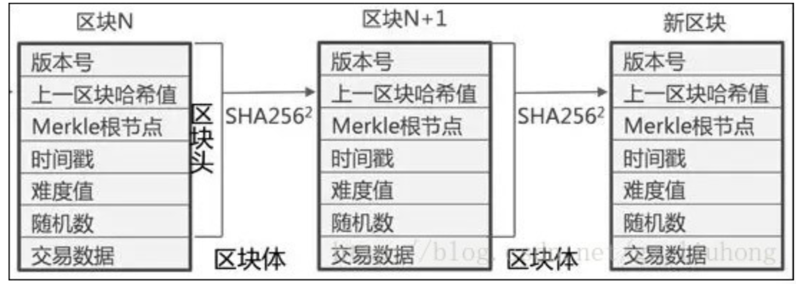

[TOC]

# 初识区块链

## 去中心化&比特币

* 纸币 》 记账货币 》 分布式货币
* 不能超发，避免膨胀，无中心
* 不能篡改

### BTC特性

1. 上限2100万枚

2. 挖矿：参与记账实现分配和发行

3. 分割性：1 BTC = 10^18 聪

4. 哈希：不可篡改、不可伪造

5. 不可双花

### 中心化缺点

1. 数据不保密，容易泄露
2. 中心可能篡改、丢失数据

### 去中心特性

1. 分布式
2. 可追溯
3. 不可篡改

### 区块链体系

####  区块结构

   

#### 哈希散列
   > 一种保证原始数据不被篡改的二进制算法

   1.1 相同数据hash相同

   1.2 hash非对称

####  区块

承载交易的数据包

#### 挖矿 

不断计算Nonce使得生成Hash值满足给定难度的过程

#### 挖矿伪代码演示

>  所谓的挖矿就是计算Nonce的过程,让Nonce匹配给定的Hash值,Hash值前面的0越 多,则说明难度越大 

* 判断生成的Hash值是否符合难度 


```python
function isValidHashDifficulty(hash, difficulty) {
  for (var i = 0, b = hash.length; i < b; i ++) {
      if (hash[i] !== '0') {
          break;
          }
  } 
  return i >= difficulty;
}
```

* 通过不断测试nonce来找到符合条件的Hash值 

```python
let nonce = 0;
let hash;
let input;
while(!isValidHashDifficulty(hash, difficulty)) {
  nonce = nonce + 1;
  input = index + previousHash + timestamp + data + nonce;
  hash = CryptoJS.SHA256(input)
}

```

} 

####  矿工/矿机/矿池

* 打包区块的人称为矿工,运算Nonce机器称为矿机 
* 单机已很难挖矿成功，加入矿池，按照比例分配成果

####  难度目标 

* 打包区块的难度,例如在比特币体系中通过调整难度目标,使得大约每10分钟左右生 成一个区块 

### 共识机制

#### 工作证明(POW Proof of work) 

   * 简单理解就是一份<u>***证明***</u>，用来确认你做过一定量的工作,例如:期末获得了优秀员工,就是你努力工作的证明. 

   * 工作证明的设计原理

     1. 取一些公开的数据(在比特币中取区块头的数据)  
     2. 给这个公开数据添加一个计数器,计数器默认从0开始(在区块链中计数器就是nonce)

     3. 将 data(数据) 和 counter(计数器) 组合到一起,获得一个哈希检查哈希是否符合一定的条件

     4. 如果符合条件，结束如果不符合,增加计数器,重复步骤:3­-4. 
* 浪费：因为只有算出符合条件的hash者有奖励，而其他人没有，却耗费了庞大算力。


#### 股权证明 (POS Proof of stake) 

* 在POS模式下,有一个名词叫币龄,每个币每天会产生1币龄.(100个币,共持了30天, 那么币龄就是3000) 
* POS也需要挖矿,但是币龄越多的人挖矿越容易,如果发现了一个区块,则获得奖励, 但之前的币龄就会被清空 
* POW中决定谁更能挖到矿的是算力.而POS不同.决定谁更可能挖到币的是"币数 量" + "币龄" 
* POW导致了算力的浪费,而POS则慢慢会导致贫富差距扩大 

#### 委托权益证明 (DPOS : Delegated Proof of Stake) 

1. 类似人大代表制度,理解为N个节点,N个超级节点彼此的权利是完全等同的. 
2. 不挖矿,采用超级节点方式来记账,靠数字货币增发来奖励超级节点
3. 当前EOS采用此模式,此方式也称为半去中心化. 

# 比特币

## 比特币特性 

### 基本特点

1. 完全去中心化,比特币发行不依赖国家、银行或者企业 
2. 总量一定:2100万枚
3. 匿名记账:通过一个34位的钱包地址来进行交易 
4. 矿工记账的过程，即比特币发行和分配的过程

### 比特币交易 

* 所谓比特币交易就是从一个比特币钱包向另一个中转.每笔交易都有数字签名来保 证安全.交易生效那么就对多有人都公开. 
* 钱包下载与使用:[https://bitcoin.org/zh_CN/download](https://bitcoin.org/zh_CN/download)

### 产量减半

* 本质上是在模拟黄金,由于黄金储量有限,挖掘速率会越来越慢,因此比特币也被成为数 字黄金,比特币生产也俗称挖矿),规定了在每产生**210000**个区块后,比特币产量减半,一 开始每个区块产生50个比特币,后来逐步减半,直到逼近为零 (**逼近为零时,每笔交易手续 费就成为矿工的收入来源**) 


### 交易效率问题

每个区块大小被限定在1M，每个交易大约250字节，所以每个区块最多容纳4000 个交易。由于每个被认可的区块平均产生时间为10分钟，意味着每秒钟只能处理7 个交易 

每个区块有高度，确认数(后面的区块)、前hash、后hash、默克尔根节点

确认数大于6，则被认为安全

### Merkle tree (默克尔树) 

Merkle树被应用在了交易的存储上。每笔交易都会生成一个hash值，然后不同的 hash值向上继续做hash运算，最终生成唯一的Merkle根。并把这个Merkle根放入 数据区块的区块头 

### 交易手续费

手续费：一个区块里所有交易总的手续费

手续费 + 系统奖励 = 旷工收入

手续费可以人工设置为更高，一般延迟越高，手续费越高。

## 双花 & 分叉

### 双花

1. 每笔交易都需要先确认对应比特币之前的状态，如果它之前已经被标记为花掉，那么新的交易会被拒绝 
2. 如果诈骗者利用网络延迟同一笔金额在不同电脑花两次. 
3. 下一个矿工选择在A基础上继续记账的话，A分支就会比B分支更长，根据区块链的规则，最长的分支会被认可 

* 孤矿：出现双花之后，分支较短的成为孤矿。
* 确认数超过6时，才会获得挖矿奖励。

### 分叉

* BTC,区块大小仅为1M(每笔交易250字节,因此一个区块只能容纳4000笔交易)，而且会出现交易延迟，交易费也越来越高.由于没有中央节点,社区意见很难统一,这就是数字货币常说的一言不合玩分叉! 
#### 软分叉&硬分叉
   * 如果你遇到一个硬分叉,它意味着某种数字货币——比如比特币——的新版本软件 和旧版本无法兼容,彼此看不顺眼,必须各走各路.而软分叉则不同,新版本要求更为 严苛，不同意旧版本的一些规则;但旧版本比较憨厚，还能接受新版本软件. 

#### 硬分叉


# 打造项目 

## 架构

### 需求 & 设计

1. 创建钱包
2. 挖矿
3. 交易
4. 工作量证明


end